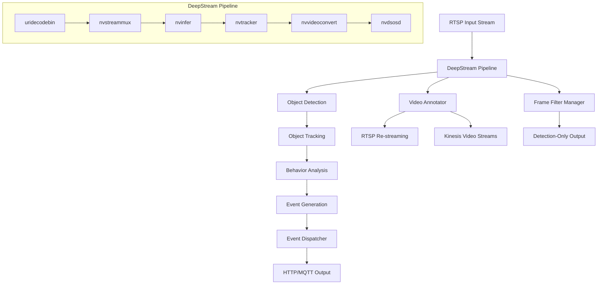
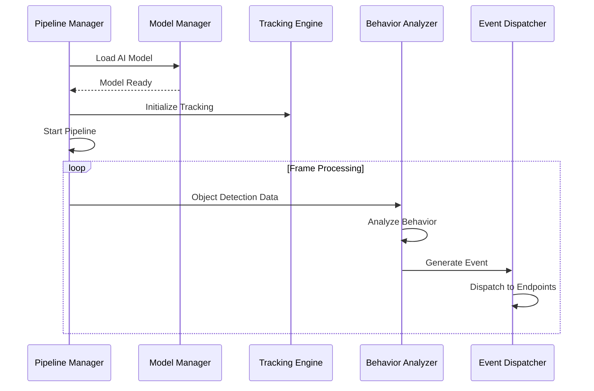
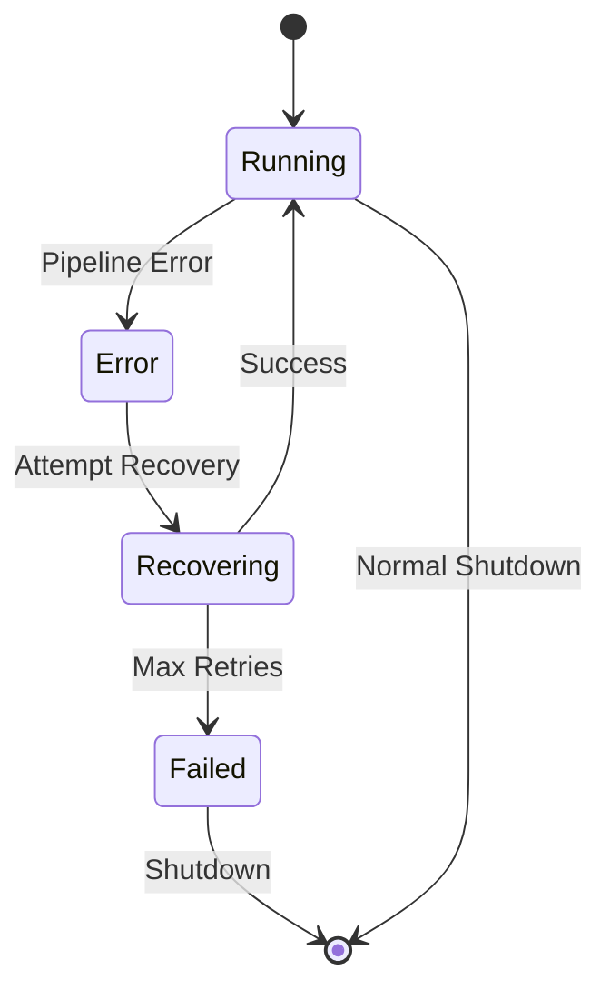

# Design Document - RTSP Object Detection System

## Overview

The RTSP Object Detection System is a real-time video analytics solution built on NVIDIA DeepStream that processes live video streams using AI models for object detection, tracking, and behavioral analysis. The system leverages DeepStream's optimized GStreamer-based pipeline architecture to achieve low-latency processing while providing flexible event generation and multi-protocol streaming capabilities.

### Key Design Principles

- **KISS (Keep It Simple, Stupid)**: Minimize custom code and maximize reuse of existing DeepStream components
- **DeepStream-Native**: Use standard DeepStream configuration files (.txt format) and interfaces wherever possible
- **Minimal Custom Logic**: Only implement what DeepStream doesn't provide out-of-the-box
- **Configuration-First**: Leverage DeepStream's existing configuration system rather than building custom parsers
- **Plugin Reuse**: Use existing DeepStream plugins and probe functions instead of custom implementations

## Architecture

### High-Level Architecture



### DeepStream Pipeline Architecture

The system implements a standard DeepStream pipeline with the following components:

1. **Input Stage**: `uridecodebin` for RTSP stream decoding
2. **Stream Multiplexing**: `nvstreammux` for batching and format conversion
3. **AI Inference**: `nvinfer` for object detection using ONNX/TensorRT models
4. **Object Tracking**: `nvtracker` for maintaining object identities across frames
5. **Video Processing**: `nvvideoconvert` for format conversions
6. **Overlay Generation**: `nvdsosd` for drawing bounding boxes and labels
7. **Output Stage**: Multiple sinks for re-streaming (RTSP, UDP, HLS)

**Design Rationale**: DeepStream's pipeline architecture provides hardware-accelerated processing with minimal CPU overhead, essential for real-time performance requirements.

## Components and Interfaces

### Core Components

#### 1. Pipeline Manager
- **Responsibility**: Manages the DeepStream GStreamer pipeline lifecycle
- **Key Functions**:
  - Pipeline construction and configuration
  - Error handling and recovery
  - Resource management
- **Interface**: Exposes pipeline control methods (start, stop, restart)

#### 2. Model Manager
- **Responsibility**: Handles AI model loading and configuration
- **Key Functions**:
  - ONNX/TensorRT model validation and loading
  - Model-specific configuration management
  - GPU memory optimization
- **Interface**: Model loading API with validation callbacks

#### 3. Tracking Engine
- **Responsibility**: Wraps DeepStream's nvtracker functionality
- **Key Functions**:
  - Object ID assignment and maintenance
  - Re-identification logic
  - Tracking configuration management
- **Interface**: Tracking event callbacks and configuration API

#### 4. Behavior Analyzer
- **Responsibility**: Analyzes object behaviors and generates events
- **Key Functions**:
  - Object appearance/disappearance detection
  - Static object detection with configurable thresholds
  - Movement pattern analysis
- **Interface**: Event generation callbacks with structured data

#### 5. Event Dispatcher
- **Responsibility**: Manages event delivery to external systems
- **Key Functions**:
  - Multi-protocol event delivery (HTTP, MQTT)
  - Retry logic with exponential backoff
  - Event formatting and serialization
- **Interface**: Pluggable delivery mechanism with configuration

#### 6. Configuration Manager
- **Responsibility**: Handles system configuration and hot-reloading
- **Key Functions**:
  - YAML/JSON configuration parsing
  - Configuration validation
  - Runtime configuration updates
- **Interface**: Configuration change notifications

#### 7. Frame Filter Manager
- **Responsibility**: Manages detection-only frame output functionality
- **Key Functions**:
  - Frame filtering based on detection presence
  - Timestamp preservation for saved frames
  - Storage optimization logic
- **Interface**: Frame filtering callbacks and configuration API

#### 8. Stream Output Manager
- **Responsibility**: Manages multiple video output streams including RTSP and Kinesis Video Streams
- **Key Functions**:
  - RTSP server management for local streaming
  - AWS Kinesis Video Streams integration
  - Stream format conversion and optimization
  - Output stream health monitoring
- **Interface**: Stream configuration and status monitoring API

### Component Interactions



## Data Models

### Detection Metadata
```json
{
  "frame_id": "integer",
  "timestamp": "ISO8601",
  "objects": [
    {
      "tracking_id": "integer",
      "class_id": "integer",
      "class_name": "string",
      "confidence": "float",
      "bbox": {
        "x": "float",
        "y": "float", 
        "width": "float",
        "height": "float"
      }
    }
  ]
}
```

### Event Schema
```json
{
  "event_id": "uuid",
  "event_type": "object_appeared|object_static|object_moving",
  "timestamp": "ISO8601",
  "object": {
    "tracking_id": "integer",
    "class_name": "string",
    "position": {
      "x": "float",
      "y": "float"
    }
  },
  "metadata": {
    "duration": "integer (for static events)",
    "confidence": "float"
  }
}
```

### Configuration Schema

**Design Rationale**: Use DeepStream's native .txt configuration format to minimize custom parsing code and leverage existing DeepStream configuration infrastructure.

#### DeepStream Application Config (deepstream_app_config.txt)
```ini
[application]
enable-perf-measurement=1
perf-measurement-interval-sec=5

[tiled-display]
enable=1
rows=1
columns=1
width=1920
height=1080

[source0]
enable=1
type=4
uri=rtsp://192.168.1.100:554/stream
num-sources=1
gpu-id=0
cudadec-memtype=0

[sink0]
enable=1
type=4
sync=0
source-id=0
gpu-id=0
rtsp-port=8554

[sink1]
enable=1
type=6
sync=0
source-id=0
gpu-id=0
# Kinesis Video Streams sink
stream-name=detection-stream
aws-region=us-east-1

[osd]
enable=1
gpu-id=0
border-width=2
text-size=15
text-color=1;1;1;1
text-bg-color=0.3;0.3;0.3;1
font=Serif
show-clock=0
clock-x-offset=800
clock-y-offset=820
clock-text-size=12
clock-color=1;0;0;1

[streammux]
gpu-id=0
batch-size=1
batched-push-timeout=40000
width=1920
height=1080
enable-padding=0
nvbuf-memory-type=0

[primary-gie]
enable=1
gpu-id=0
model-engine-file=/models/detection.engine
labelfile-path=/configs/labels.txt
batch-size=1
bbox-border-color0=1;0;0;1
bbox-border-color1=0;1;1;1
bbox-border-color2=0;0;1;1
bbox-border-color3=0.5;0.5;0.5;1
interval=0
gie-unique-id=1
nvbuf-memory-type=0
config-file-path=/configs/detection_config.txt

[tracker]
enable=1
tracker-width=640
tracker-height=384
ll-lib-file=/opt/nvidia/deepstream/deepstream/lib/libnvds_nvmultiobjecttracker.so
ll-config-file=/configs/tracker_config.yml
gpu-id=0
enable-batch-process=1
```

#### Detection Model Config (detection_config.txt)
```ini
[property]
gpu-id=0
net-scale-factor=0.0039215697906911373
model-color-format=0
onnx-file=/models/detection.onnx
model-engine-file=/models/detection.engine
labelfile-path=/configs/labels.txt
batch-size=1
network-mode=0
num-detected-classes=80
interval=0
gie-unique-id=1
process-mode=1
network-type=0
cluster-mode=2
maintain-aspect-ratio=1
parse-bbox-func-name=NvDsInferParseYolo
custom-lib-path=/opt/nvidia/deepstream/deepstream/lib/libnvdsinfer_custom_impl_Yolo.so

[class-attrs-all]
nms-iou-threshold=0.3
pre-cluster-threshold=0.2
topk=300
```

#### Minimal Custom Configuration (app_config.yaml)
```yaml
# Only custom behavior not covered by DeepStream configs
behavior:
  static_threshold_seconds: 30
  position_tolerance_pixels: 10
  debounce_seconds: 2

events:
  http:
    endpoint: "http://api.example.com/events"
  mqtt:
    broker: "mqtt.example.com"
    topic: "detection/events"

frame_saving:
  detection_only_mode: false
  output_path: "/data/frames"
```

**Design Rationale**: Structured configuration allows for deployment flexibility while maintaining type safety and validation.

## Error Handling

### Error Categories and Strategies

#### 1. Pipeline Errors
- **Stream Connection Failures**: Automatic reconnection with exponential backoff
- **GPU Memory Issues**: Graceful degradation with error reporting
- **Model Loading Failures**: Validation and detailed error messages

#### 2. Processing Errors
- **Frame Drop Handling**: Logging and metrics collection
- **Tracking Failures**: ID reassignment and continuity maintenance
- **Inference Errors**: Fallback to previous frame data

#### 3. Event Delivery Errors
- **Network Failures**: Retry mechanism with circuit breaker pattern
- **Endpoint Unavailability**: Event queuing with overflow protection
- **Serialization Errors**: Error logging and event skipping

### Error Recovery Mechanisms



**Design Rationale**: Robust error handling ensures system reliability in production environments where continuous operation is critical.

## Testing Strategy

### Unit Testing
- **Component Isolation**: Mock DeepStream components for unit tests
- **Configuration Validation**: Test all configuration scenarios
- **Event Generation Logic**: Verify behavior analysis algorithms

### Integration Testing
- **Pipeline Integration**: Test complete DeepStream pipeline with sample videos
- **Model Loading**: Validate ONNX and TensorRT model compatibility
- **Event Delivery**: Test HTTP and MQTT delivery mechanisms

### Performance Testing
- **Throughput Testing**: Measure frames per second under various loads
- **Memory Usage**: Monitor GPU and system memory consumption
- **Latency Testing**: Measure end-to-end processing latency

### Container Testing
- **GPU Passthrough**: Verify CUDA/TensorRT access in containers
- **Resource Limits**: Test behavior under resource constraints
- **Multi-Platform**: Validate on Jetson and desktop GPU platforms

**Design Rationale**: Comprehensive testing strategy ensures reliability across different deployment scenarios and hardware configurations.

### Test Data Requirements
- Sample RTSP streams with known object patterns
- Pre-trained ONNX/TensorRT models for validation
- Mock HTTP/MQTT endpoints for integration testing
- Performance benchmarking datasets

This design provides a solid foundation for implementing a production-ready RTSP object detection system that meets all specified requirements while leveraging DeepStream's optimized capabilities.